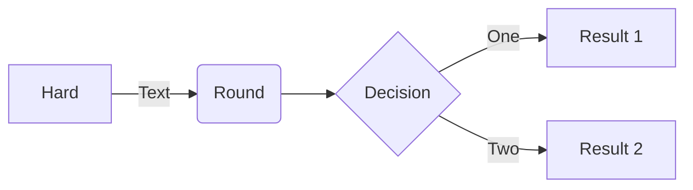

# Silver Bullet plug for Mermaid diagrams
This plug adds basic [Mermaid](https://mermaid.js.org/) support to Silver Bullet.

For example:



**Note:** this plug is compatible with SilverBulet v2.

**Note:** The Mermaid library itself is not bundled with this plug, it pulls the JavaScript from the JSDelivr CDN. This means _this plug will not work without an Internet connection_. The reason for this is primarily plug size (bundling the library would amount to 1.1MB). This way Mermaid is only loaded on pages with actual Mermaid diagrams rather than on every SB load.

## Installation
In your CONFIG page, add the mermaid plug, e.g.:

    ```space-lua
    config.set {
      plugs = {
        "github:silverbulletmd/silverbullet-mermaid/mermaid.plug.js"
      }
    }
    ```

Then run the `Plugs: Update` command.


## Use

Put a mermaid block in your markdown:

    ```mermaid
    flowchart TD
        Start --> Stop
    ```

And move your cursor outside of the block to live preview it!

## Configuration 

You can use the `mermaid` config to tweak a few things:

    ```space-lua
    config.set("mermaid", {
      version = "11.4.0",
      integrity = "new integrity hash",
      -- or disable integrity checking
      integrity_disabled = true
      -- optional: register icon packs 
      icon_packs = {
        {
          name = "logos",
          url = "https://unpkg.com/@iconify-json/logos@1/icons.json",
        },
      },
    })
    ```

