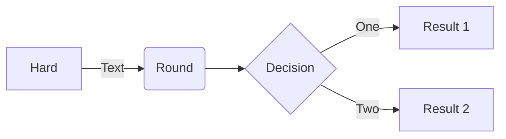

This plug adds basic [Mermaid](https://mermaid.js.org/) support to Silver Bullet.

For example:


```mermaid
flowchart LR

A[Hard] -->|Text| B(Round)
B --> C{Decision}
C -->|One| D[Result 1]
C -->|Two| E[Result 2]
```

**Note:** The Mermaid library itself is not bundled with this plug, it pulls the JavaScript from the JSDelivr CDN. This means _this plug will not work without an Internet connection_. The reason for this is primarily plug size (bundling the library would amount to 1.1MB). This way Mermaid is only loaded on pages with actual Mermaid diagrams rather than on every SB load.

## Configuration 
You can use the `mermaid` config to tweak a few things:

    ```space-lua
    config.set("mermaid", {
      version = "11.4.0",
      integrity = "new integrity hash",
      -- or disable integrity checking
      integrity_disabled = true
      -- optional: register icon packs 
      icon_packs = {
        {
          name = "logos",
          url = "https://unpkg.com/@iconify-json/logos@1/icons.json",
        },
      },
    })
    ```

## Theming

The plug provides some additional option in regards to using themes and handling of
dark mode.

### Fill background option

The plug adds an option to fill the background of the diagram with the background color.

Normally mermaid uses the background of the webpage, and draws boxes and lines on top of it.
If you use a theme intended for a light background with an actual dark background, the diagram becomes unreadable with dark lines and text on the dark background.
The mermaid themes have a defined background color, but that is not used for the actual background and instead "used to calculate color for items that should either be background colored or contrasting to the background".
The `fill background` option in the plug just takes that background color from the theme and draws it as a solid color behind the diagram. Which means you can use light themes while in dark mode, for example for diagrams that have a lot of custom colors defined.

### Config

    ```space-lua
    config.set("mermaid", {
      -- Custom themes can be used to create a new theme, with custom colors.
      -- See https://mermaid.ai/open-source/config/theming.html#theme-variables
      -- Use 'based_on' to define a theme to use as baseline. According to the mermaid
      -- documentation, only "base" is supported as base for custom themes, but in
      -- practice it seems to also work with other default themes. Your mileage may vary.
      custom_themes = {
        foresty = { based_on="forest", background="#CCC"}
      },
      -- Configure default theme. Mermaid provides "default", "base", "dark", "forest", "neutral", "null" (default: "default")
      theme = "foresty",
      -- Configure default theme for dark mode (default: use the theme from light mode)
      theme_darkmode = "dark",
      -- Configure look. "handDrawn" or "classic" (default: "classic")
      look = "classic",
      -- Fill the background of the diagram with the background color (default: false)
      fill_background = true,
    }
    ```

### Frontmatter

mermaid has standard support for frontmatter, but the plug supports some additional values in the frontmatter.

    ```mermaid
    ---
    config:
      theme: foresty
      themeDarkmode: dark
      fillBackground: true
    ---
    flowchart TD
        Start --> Stop
    ```

`theme` is normally supported in mermaid frontmatter, but the plug adds support for the custom themes in the config. `themeDarkmode` and `fillBackground` override zthe corresponding config settings.
